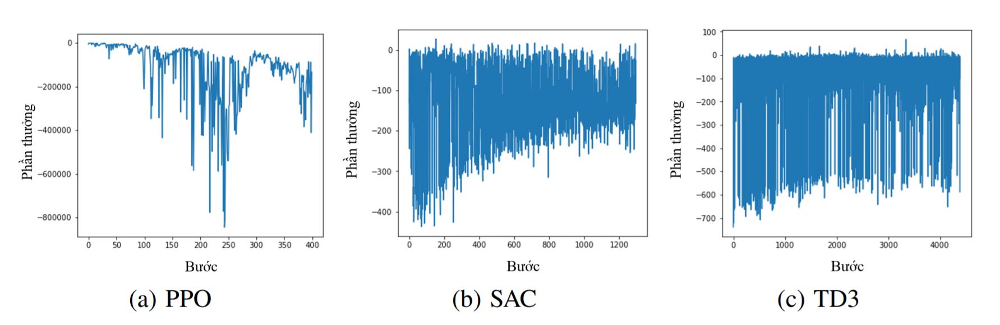
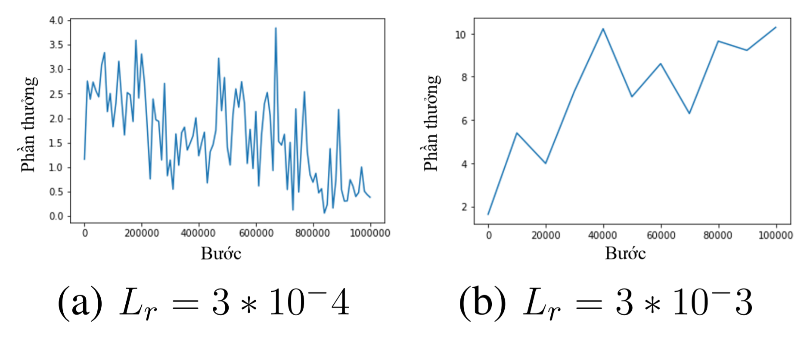

# Reinforcement Learning for 4 Legged Robot


## Getting Started

These instructions will demonstrate how to setup a conda environment with all requirements for the project setup.

### Installing

```
conda env create -n rl_dev python=3.6

conda activate rl_dev

git clone https://github.com/NguyenCanhThanh/4Legged_RL.git

cd 4Legged_RL

python setup.py install 

jupyter notebook
```

### Results

#### Compare Algorithm:

The notebook uses the same hyperparameters and architecture described in the paper. The agent is trained for 5 million timesteps. The agent converged on a successfull policy after 400k timesteps. The results below show the agents avg score over the previous 100 episodes.

As you can see, SAC Autoturn Temperature Algorithms gives better results g or equivalent to standards such as TD3 and PP0

 

#### Learning Rate:

[](https://colab.research.google.com/drive/1dHWlM7BWYqQ4Yc_LuQYij5zWhSapzxAD?usp=sharing)

An implementation of the SAC Autoturn Temperature Algorithms trained on the Roboschool Minitaur Bullet environment using pytorch found [here](https://github.com/NguyenCanhThanh/4Legged_RL/blob/main/SAC_Minitaur_TF.ipynb). 
The results are described via video [here](https://youtu.be/ZIPqQUQlFTg)

 

## Acknowledgments

* OpenAI [Spinning Up](https://github.com/openai/spinningup)
* OpenAI [Baselines](https://github.com/openai/baselines)


PyTorch code of: proximal policy optimization / ddpg / twin dueling ddpg / soft actor critic


  1.  Proximal Policy Optimization Algorithms 
  - [ppo.ipynb](https://github.com/NguyenCanhThanh/4Legged_RL/blob/main/ppo.ipynb)
  - [PPO Paper](https://arxiv.org/abs/1707.06347)
  - [OpenAI blog](https://blog.openai.com/openai-baselines-ppo/)
  2.  Continuous control with deep reinforcement learning
  - [ddpg.ipynb](https://github.com/NguyenCanhThanh/4Legged_RL/blob/main/ddpg.ipynb)
  - [DDPG Paper](https://arxiv.org/abs/1509.02971)
  3. Addressing Function Approximation Error in Actor-Critic Methods
  - [td3.ipynb](https://github.com/NguyenCanhThanh/4Legged_RL/blob/main/td3.ipynb)
  - [Twin Dueling DDPG Paper](https://arxiv.org/abs/1802.09477)
  4. Soft Actor-Critic: Off-Policy Maximum Entropy Deep Reinforcement Learning with a Stochastic Actor 
  - [soft actor-critic.ipynb](https://github.com/NguyenCanhThanh/4Legged_RL/blob/main/soft%20actor-critic.ipynb)
  - [Soft Actor-Critic Paper](https://arxiv.org/abs/1801.01290)

